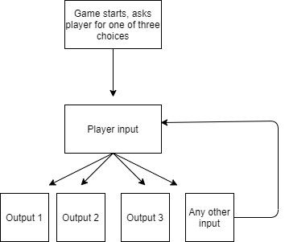

## C++ Chapter 4 & 5
<b>3.1.</b> Three common errors in making selection structures are using a compound condition rather than a nested one, reversing inner and outer decisions, and using an unnecessary selection structure. 
<b>3.2.</b> Using a compound condition makes a structure inefficient but produce the correct result.  
<b>3.3.</b> 
